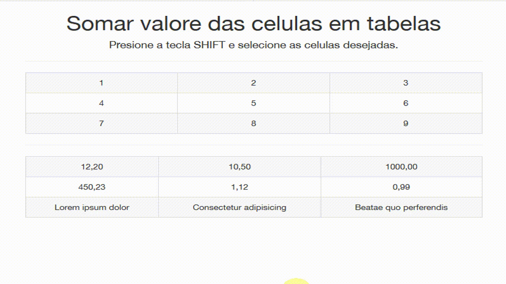

vTableCount (Firefox Extension)
==========

Somar valores em células de tabelas. Presione a tecla SHIFT e selecione as células da tabela.

Install (Firefox)
-----------
1. Visit Listen1 Firefox Page https://addons.mozilla.org/pt-BR/firefox/addon/vtablecount/?src=search
2. Click Add to Firefox button

Changelog
-------
`11/04/2019`
* Fix block select text

`10/04/2019`
* Fix soma de valores em milhoes
* Fix soma de valores com R$

`10/04/2019`
* Publicado

License
--------
MIT